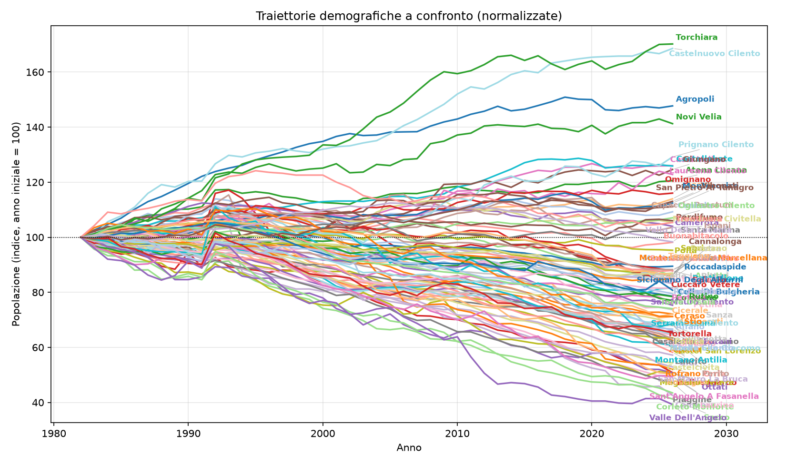
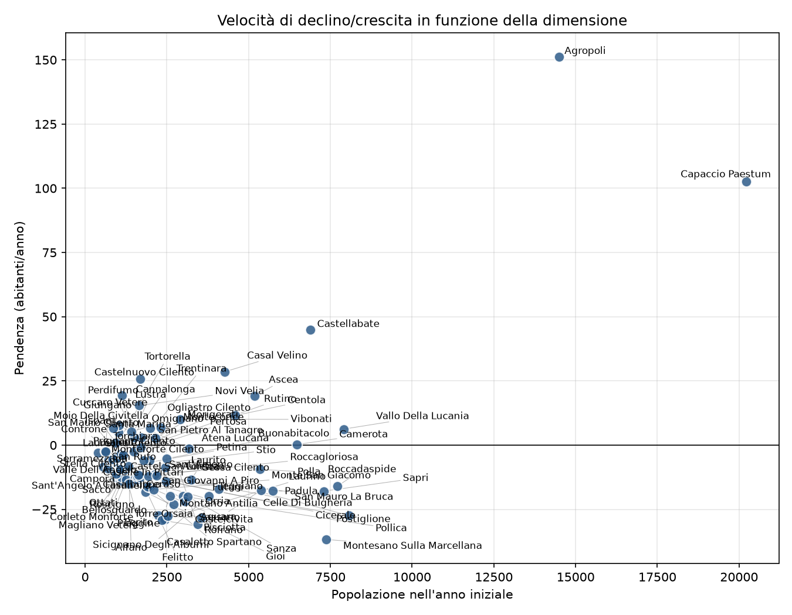
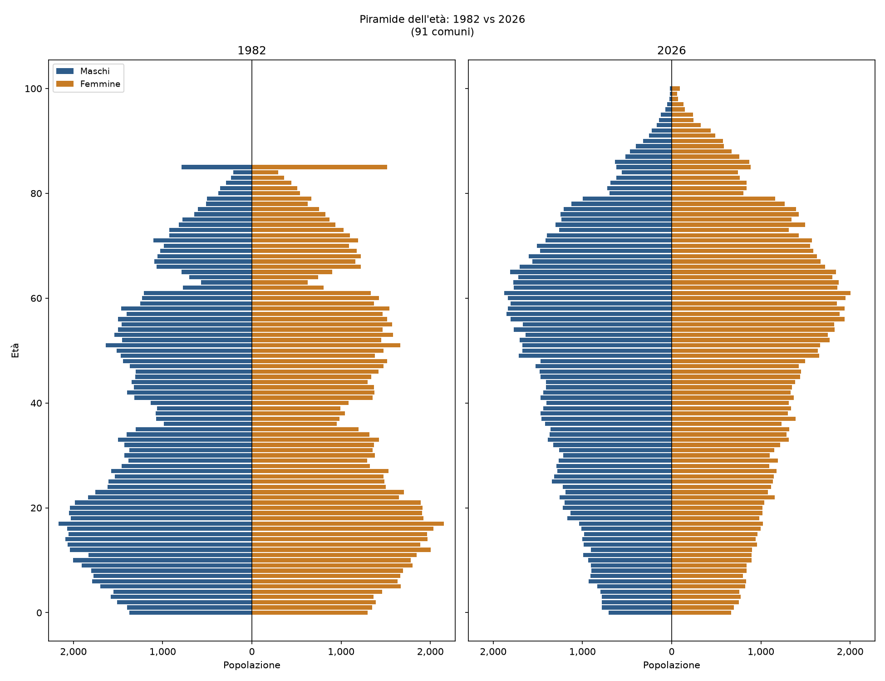
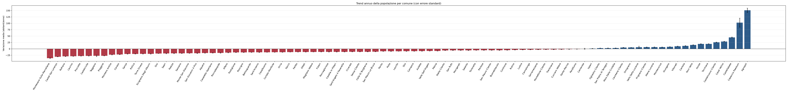

# Cilento population trends (1982-2026)

Population trends of 91 towns in the Cilento area (province of Salerno), using
ISTAT resident population data from 1982 to 2026. Linear and polynomial fits per
comune, a comparison between coastal and inland towns, and a 20-year projection.

The full report (in Italian) is in [`results/pdf/report_cilento.pdf`](results/pdf/report_cilento.pdf).
The main results are also shown in the readme.

## What the code does

### `analisi_comuni.py`

- Reads `popolazione_combinata_1982_2026.csv`, the yearly population by comune, age
  and sex. This file merges three ISTAT sources: the 1982-1991 population
  reconstruction, the 1992-2019 intercensal reconstruction and POSAS 2020-2026.
- For each town in `COMUNI` it computes:
  - absolute and % change between the first and the last year
  - a linear regression of population on year: slope (residents/year), its standard
    error, RMSE and R²
  - a degree-2 polynomial fit, used to project the population 20 years after the
    last year (2046). Projections are clipped at 0.
- Writes the summary table to `results/tabella_comuni.csv` and 7 plots to `results/png/`.

### `report.py`

- Reads `results/tabella_comuni.csv` and splits the towns into coastal (15) and
  inland (76).
- Computes the aggregate numbers and makes 7 more plots in `results/png/`.
- Writes `results/report.md` and converts it to PDF with pandoc
  (`results/pdf/report_cilento.pdf`).

### Output

```
results/
├── tabella_comuni.csv     summary table, one row per comune
├── report.md, report.css  report source
├── png/                   all plots
└── pdf/                   report_cilento.pdf
```

## Results

### Overall

Across the 91 towns the population went from **248,765 to 230,044** residents
(-18,721, **-7.5%**). Capaccio Paestum only has data from 2002, so its starting value
is from 2002. Without it the change is -9.2%.

67 towns out of 91 (74%) lost population. The median change is **-20.5%**,
33 towns lost more than 30% and 7 lost more than half:

| Largest losses | 1982 | 2026 | % |
| --- | ---: | ---: | ---: |
| Valle dell'Angelo | 553 | 217 | -60.8 |
| Sacco | 955 | 394 | -58.7 |
| Campora | 697 | 297 | -57.4 |
| Corleto Monforte | 1,063 | 462 | -56.5 |
| Piaggine | 2,239 | 1,056 | -52.8 |

| Largest gains | 1982 | 2026 | % |
| --- | ---: | ---: | ---: |
| Torchiara | 1,121 | 1,908 | +70.2 |
| Castelnuovo Cilento | 1,690 | 2,849 | +68.6 |
| Agropoli | 14,500 | 21,418 | +47.7 |
| Novi Velia | 1,648 | 2,328 | +41.3 |
| Prignano Cilento | 860 | 1,111 | +29.2 |

In absolute terms Agropoli is the outlier (+6,918 residents). The largest absolute
losses are in Castel San Lorenzo, Laurino, Piaggine, Castelcivita and Pisciotta,
between 1,135 and 1,258 residents each.


Normalized trajectories (first year = 100):



### Coast vs inland

This is the main result. Coastal comuni have a median change of **+9.2%** (n=15),
inland comuni **-25.3%** (n=76), so the gap is about 35 percentage points. Taken as
groups, the coast went from 89,390 to 99,930 residents (+11.8%) and the inland from
159,375 to 130,114 (-18.4%). The coastal share of the population went from 36% to 43%.

13 inland comuni grew (Torchiara, Castelnuovo Cilento,
Novi Velia, Prignano Cilento, Giungano, ...), and 4 coastal ones shrank: Pisciotta
(-32.0%), Pollica (-31.8%), Sapri (-14.1%) and San Giovanni a Piro (-12.0%).

The size of the comune alone explains little: the correlation between the starting
population and the % change is r = 0.31.




### Age structure

Age pyramid of all the comuni together, 1982 vs 2026. The base is about half as
wide as in 1982, the largest cohorts are now around 50-65 years old, and there are
many more people over 80. In the 1982 source all ages from 85 up are in a single
class, which is why there's a spike at 85.



### Projections to 2046

The sum of the single linear fits gives -433 residents/year for the whole area,
about 221,000 residents in 2046.


With the quadratic fit, 80 comuni out of 91 keep declining. Four of them go to zero
by 2046 (Campora, Rofrano, Sant'Angelo a Fasanella, Valle dell'Angelo), and
Roscigno is projected at 5 residents. The best prospects are Prignano Cilento
(+27.5%), Giungano (+23.0%) and Casal Velino (+21.6%).


These numbers should be taken with care, because the parabola bends outside the
observed period. For comuni whose growth slowed down in recent years it bends
downwards: Agropoli is projected at -12.7%, and Capaccio Paestum drops from 22,463
to 13,839. For declining comuni it makes the decline steeper than the historical
trend: Rofrano goes to 0 with the quadratic fit, but the linear trend would give
about 640 residents in 2046. They show where the trend points, they aren't forecasts.

### Per-comune plots


