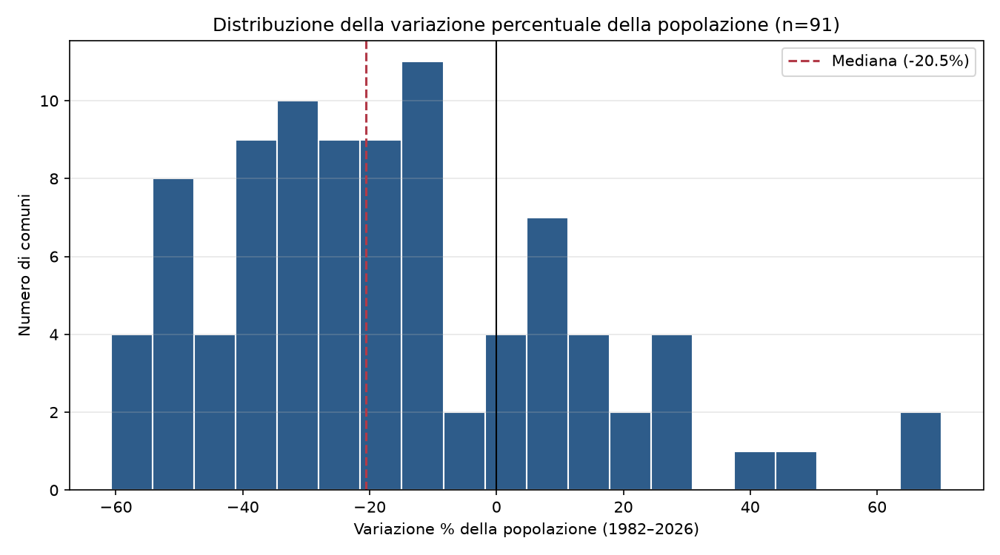
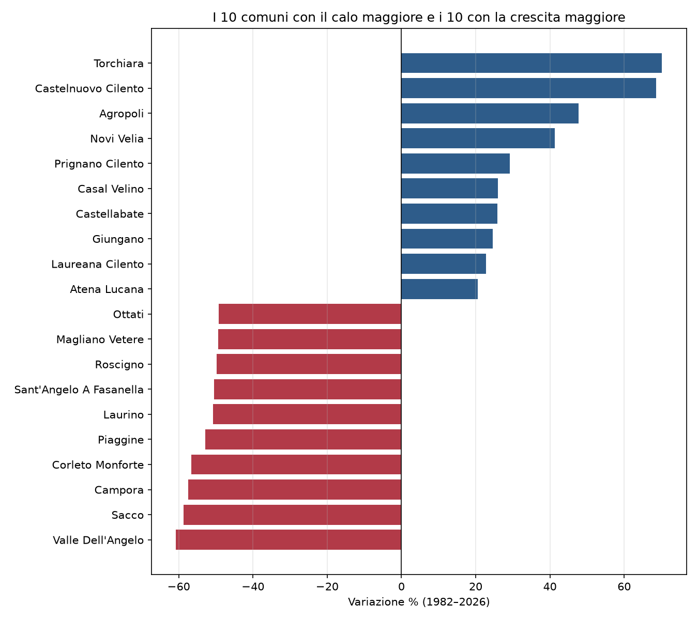
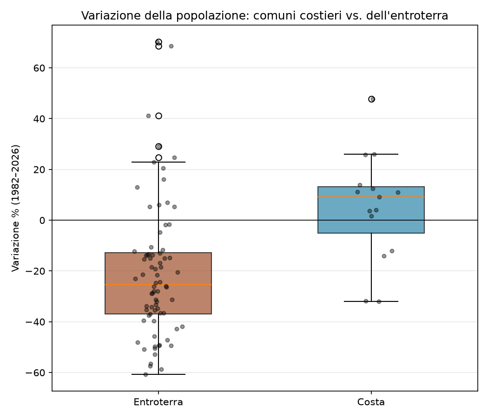
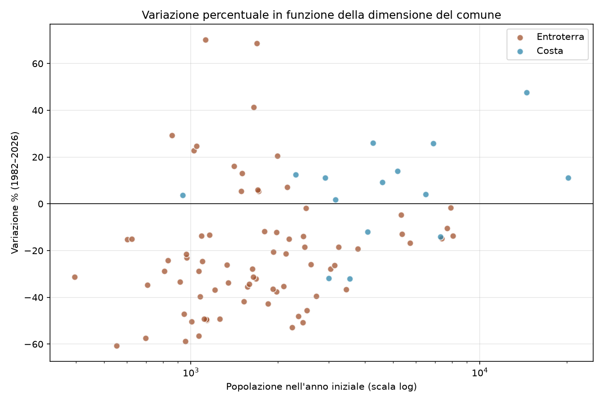
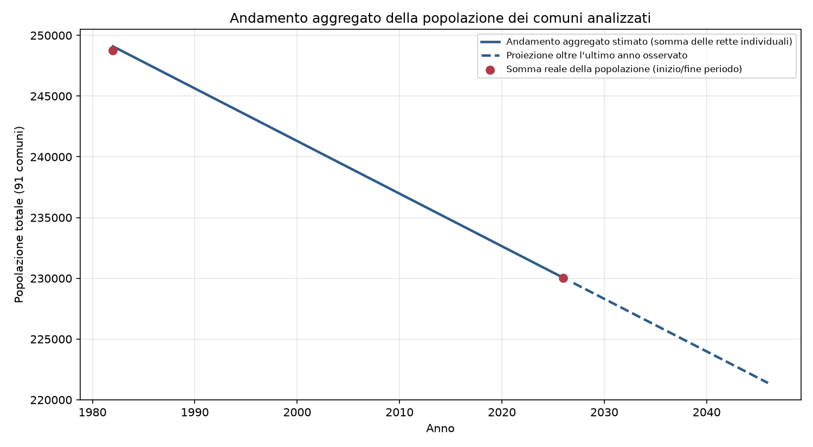
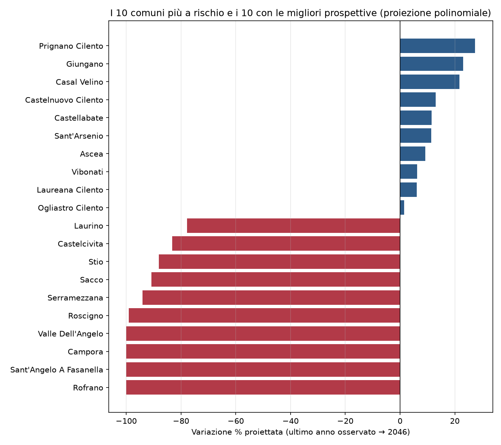
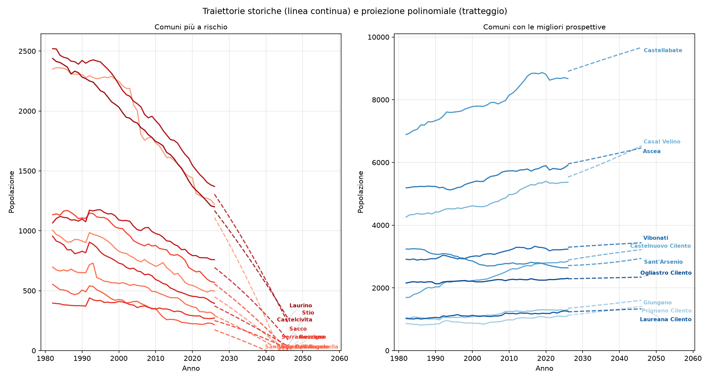

# Abstract {-}

Questo lavoro analizza l'andamento della popolazione residente di
**91 comuni** dell'area del Cilento (provincia di
Salerno) nel periodo **1982-2026**, integrando
fonti storiche ISTAT eterogenee (ricostruzioni intercensuarie e bilanci
demografici POSAS) in un'unica serie temporale armonizzata. Nel periodo
considerato la popolazione aggregata dei comuni analizzati è passata da
**248,765** a **230,044** abitanti
(**-7.5%**), con il
**74%** dei comuni in calo. Emerge una netta
divergenza tra i comuni costieri (variazione mediana
**+9.2%**) e quelli dell'entroterra (variazione
mediana **-25.3%**), che discutiamo alla luce
della letteratura esistente sullo spopolamento delle aree interne italiane.

# Introduzione

Lo spopolamento dei piccoli comuni dell'entroterra meridionale è un
fenomeno ampiamente documentato a livello nazionale. Circa la metà dei
comuni italiani ricade nelle cosiddette "aree interne" secondo la
classificazione della Strategia Nazionale per le Aree Interne (SNAI),
territori caratterizzati da difficile accesso ai servizi essenziali; ISTAT
stima che nei prossimi anni la quasi totalità dei comuni interni del
Mezzogiorno continuerà a perdere popolazione, con un recente aggiornamento
del Piano Strategico Nazionale che ha introdotto per alcune di queste aree
l'ipotesi di uno "spopolamento irreversibile" [1, 2].

Il fenomeno non ha risparmiato il Cilento: un'analisi del GAL Cilento
Regeneratio, che dal 2012 monitora l'andamento demografico ed economico dei
comuni dell'area attraverso periodiche indagini ("Il Cilento: tra
desertificazione sociale e prospettive di sviluppo sostenibile"), ha
documentato la persistenza del declino tra il 2002 e il 2017 [3]; fonti di
stampa che citano dati ISTAT più recenti riportano che circa i tre quarti
dei comuni del Cilento risulterebbero in fase di spopolamento [4].

Questo lavoro si propone come **complemento quantitativo e di più lungo
periodo** a queste analisi, non come primo studio del fenomeno. Il
contributo specifico è duplice: (i) l'estensione dell'orizzonte temporale a
**44 anni** (1982-2026), ottenuta armonizzando
fonti ISTAT storicamente eterogenee tra loro per struttura e non
direttamente confrontabili senza un lavoro preliminare di pulizia e
normalizzazione; (ii) un confronto sistematico, comune per comune, basato
su modelli statistici espliciti (regressione lineare e polinomiale) con
relative metriche di bontà di adattamento, anziché sulla sola variazione
percentuale grezza tra due anni. Dato il carattere strutturale e non
transitorio del fenomeno, riteniamo utile affiancare alle analisi
esistenti uno strumento quantitativo di questo tipo, riproducibile e
aggiornabile.

# Materiali e Metodi

## Fonti dei dati

I dati di popolazione residente per comune, età e sesso provengono da tre
famiglie di fonti ISTAT, integrate in un'unica serie 1982-2026:

1. **Ricostruzione della popolazione 1982-1991**: formato aggregato
   multi-anno con classi di età fino a "85 e oltre".
2. **Ricostruzione intercensuaria della popolazione 1992-2019**: serie
   annuali per età e sesso.
3. **POSAS (Popolazione per età, sesso e stato civile) 2020-2026**: bilanci
   demografici annuali più recenti, per il 2026 basati su stima.

L'integrazione ha richiesto un lavoro preliminare non banale: le tre
famiglie di fonti usano separatori, quotazioni e granularità differenti, e
due di esse contengono righe di totale identificate da codici età
convenzionali (rispettivamente "99" e "999") che, se non individuate ed
escluse esplicitamente, portano a un doppio conteggio della popolazione
totale. Tutti i valori riportati in questo lavoro fanno riferimento alla
sola componente "Totale" (somma di maschi e femmine su tutte le età),
verificata per coerenza interna (Maschi + Femmine = Totale) dove la
scomposizione per sesso è disponibile.

## Selezione dei comuni

L'analisi copre **91 comuni** dell'area del Cilento,
selezionati come sottoinsieme dei comuni della provincia di Salerno
ricadenti nell'area storico-geografica del Cilento (Alto e Basso
Cilento, Vallo di Diano, Alburni). Per **90**
comuni la serie copre l'intero periodo 1982-2026;
per Capaccio Paestum, per limiti della fonte disponibile, la serie inizia
nel 2002.

Per un sottoinsieme dell'analisi, i comuni sono stati classificati come
**costieri** (n=15) se il loro territorio comunale si
affaccia sul Mar Tirreno, **dell'entroterra** (n=76)
altrimenti. La classificazione è geografica indicativa (non una
categorizzazione ISTAT/SNAI ufficiale) e include i comuni con frazioni
costiere note (es. Marina di Casal Velino, Villammare di Vibonati) anche
quando il capoluogo comunale è collinare, come è la norma per gran parte
della costa cilentana [5].

## Metodi statistici

Per ciascun comune, la popolazione totale annua è stata modellata con:

- una **regressione lineare** (OLS) rispetto all'anno, da cui si ricavano
  la pendenza (variazione media annua, abitanti/anno), l'errore standard
  della pendenza, l'errore quadratico medio (RMSE) e il coefficiente di
  determinazione (R²);
- una **regressione polinomiale di secondo grado**, usata per stimare una
  proiezione della popolazione a 20
  anni oltre l'ultimo dato disponibile (2046),
  con tempo centrato sul primo anno di ciascuna serie per stabilità
  numerica.

L'andamento aggregato del gruppo di comuni (Figura 5) è stato ricostruito
sommando le rette di regressione individuali di ciascun comune, **non**
sommando dati grezzi anno per anno; è quindi una stima basata sui modelli
lineari individuali, coerente per costruzione con la somma reale della
popolazione nell'anno finale, ma non con eventuali oscillazioni di breve
periodo non catturate dal modello lineare.

> **Nota metodologica.** Tutte le proiezioni presentate (sia individuali
> sia aggregate) sono estrapolazioni statistiche di modelli semplici e non
> tengono conto di flussi migratori, politiche di sviluppo locale,
> interventi della Strategia Nazionale per le Aree Interne o cambiamenti
> nei tassi di natalità e mortalità. Vanno lette come indicazioni di
> tendenza, non come previsioni puntuali.

# Risultati

## Quadro d'insieme

Nel periodo 1982-2026 la popolazione
aggregata dei 91 comuni analizzati è passata da
**248,765** a **230,044**
abitanti, una variazione di **-18,721** unità
(-7.5% sul totale). Il
**67 su 91** dei comuni
(74%) ha registrato una perdita di popolazione;
**7** comuni hanno perso oltre il 50% della popolazione
iniziale e **33** oltre il 30%. La Figura 1 mostra la
distribuzione completa della variazione percentuale, con una mediana del
**-20.5%**.

## Comuni agli estremi

La Figura 2 e le Tabelle 1-2 riportano i 10 comuni con il calo
maggiore e i 10 con la crescita maggiore. Il comune con la perdita
relativa più marcata è **Valle Dell'Angelo**
(-60.8%, da
553 a
217 abitanti); il comune con la
crescita maggiore è **Torchiara**
(+70.2%).

**Tabella 1.** I 10 comuni con il calo maggiore.

| Comune | Pop. 1982 | Pop. 2026 | Var. % |
| --- | ---: | ---: | ---: |
| Valle Dell'Angelo | 553 | 217 | -60.8 |
| Sacco | 955 | 394 | -58.7 |
| Campora | 697 | 297 | -57.4 |
| Corleto Monforte | 1,063 | 462 | -56.5 |
| Piaggine | 2,239 | 1,056 | -52.8 |
| Laurino | 2,439 | 1,200 | -50.8 |
| Sant'Angelo A Fasanella | 1,005 | 498 | -50.4 |
| Roscigno | 1,134 | 570 | -49.7 |
| Magliano Vetere | 1,132 | 573 | -49.4 |
| Ottati | 1,112 | 564 | -49.3 |

**Tabella 2.** I 10 comuni con la crescita maggiore.

| Comune | Pop. 1982 | Pop. 2026 | Var. % |
| --- | ---: | ---: | ---: |
| Torchiara | 1,121 | 1,908 | 70.2 |
| Castelnuovo Cilento | 1,690 | 2,849 | 68.6 |
| Agropoli | 14,500 | 21,418 | 47.7 |
| Novi Velia | 1,648 | 2,328 | 41.3 |
| Prignano Cilento | 860 | 1,111 | 29.2 |
| Casal Velino | 4,260 | 5,368 | 26.0 |
| Castellabate | 6,890 | 8,672 | 25.9 |
| Giungano | 1,047 | 1,305 | 24.6 |
| Laureana Cilento | 1,022 | 1,255 | 22.8 |
| Atena Lucana | 1,991 | 2,400 | 20.5 |

## Costa vs. entroterra

La divergenza più marcata emersa dai dati non è tra comuni piccoli e
grandi in sé (correlazione tra popolazione iniziale e variazione %:
r=0.31, debole), ma tra comuni
costieri e dell'entroterra. I comuni costieri mostrano una variazione
mediana di **+9.2%** (n=15),
contro **-25.3%** dei comuni dell'entroterra
(n=76) — una differenza di oltre
**35 punti
percentuali** (Figura 3, Figura 4).

## Andamento aggregato e proiezione

La Figura 5 mostra l'andamento aggregato ricostruito per l'intero gruppo
di comuni (si veda Materiali e Metodi per i limiti di questa stima), con
l'estrapolazione lineare aggregata fino al 2046.

## Comuni più a rischio e con le migliori prospettive

Oltre alla variazione storica 1982-2026, il
modello polinomiale di secondo grado descritto in Materiali e Metodi è
stato usato per stimare una **variazione % proiettata** tra l'ultimo anno
osservato e l'anno di proiezione (2026→2046), distinta dalla variazione
storica: dà un'indicazione — da trattare con cautela ancora maggiore
rispetto alla proiezione storica, trattandosi di un'estrapolazione di
un'estrapolazione — di quali comuni il modello indica come più a rischio
nel breve-medio periodo e quali con le prospettive migliori.

**4 comuni** (Campora, Rofrano, Sant'Angelo A Fasanella, Valle Dell'Angelo)
risultano proiettati a **zero abitanti** entro il 2046
secondo il modello: sono classificati a pari merito (-100%) e ordinati per
popolazione attuale, così il comune con più abitanti da perdere compare
per primo nella classifica. La Figura 6 riassume i valori proiettati per
i 10 comuni più a rischio e i 10 con le prospettive migliori.

La Figura 7 mostra le stesse 20 traiettorie in forma di serie
storica (linea continua) con la relativa proiezione polinomiale (linea
tratteggiata), anziché come singolo valore aggregato: permette di
apprezzare sia la forma dell'andamento storico di ciascun comune sia dove
la proiezione lo colloca al 2046.

**Tabella 3.** I 10 comuni più a rischio secondo la proiezione polinomiale.

| Comune | Pop. 2026 | Pop. stimata 2046 | Var. % proiettata |
| --- | ---: | ---: | ---: |
| Rofrano | 1,222 | 0 | -100.0 |
| Sant'Angelo A Fasanella | 498 | 0 | -100.0 |
| Campora | 297 | 0 | -100.0 |
| Valle Dell'Angelo | 217 | 0 | -100.0 |
| Roscigno | 570 | 5 | -99.1 |
| Serramezzana | 272 | 16 | -94.1 |
| Sacco | 394 | 36 | -90.9 |
| Stio | 759 | 90 | -88.1 |
| Castelcivita | 1,370 | 230 | -83.2 |
| Laurino | 1,200 | 267 | -77.8 |

**Tabella 4.** I 10 comuni con le migliori prospettive secondo la proiezione polinomiale.

| Comune | Pop. 2026 | Pop. stimata 2046 | Var. % proiettata |
| --- | ---: | ---: | ---: |
| Prignano Cilento | 1,111 | 1,416 | 27.5 |
| Giungano | 1,305 | 1,605 | 23.0 |
| Casal Velino | 5,368 | 6,530 | 21.6 |
| Castelnuovo Cilento | 2,849 | 3,219 | 13.0 |
| Castellabate | 8,672 | 9,666 | 11.5 |
| Sant'Arsenio | 2,639 | 2,941 | 11.4 |
| Ascea | 5,914 | 6,463 | 9.3 |
| Vibonati | 3,235 | 3,438 | 6.3 |
| Laureana Cilento | 1,255 | 1,331 | 6.1 |
| Ogliastro Cilento | 2,307 | 2,343 | 1.6 |

> **Attenzione a un artefatto della curvatura polinomiale.** Alcuni dei
> comuni con la crescita storica 1982-2026 più
> marcata — Agropoli (storica +47.7%) e
> Torchiara (storica +70.2%) tra
> gli altri — **non compaiono** nella classifica delle migliori prospettive:
> il fit polinomiale di secondo grado, pur descrivendo bene i dati storici
> (R² > 0.97 per entrambi), proietta per Agropoli una variazione
> negativa (-12.7%
> al 2046). Questo è con ogni probabilità un artefatto
> dell'estrapolazione quadratica — una parabola che si adatta bene a una
> crescita che rallenta negli anni recenti può curvare verso il basso una
> volta proiettata fuori dal periodo osservato — più che un segnale reale
> di inversione di tendenza, ed è la ragione per cui queste proiezioni
> vanno lette come indicazioni di massima e non come previsioni.

# Discussione e limiti

I risultati confermano, su una finestra temporale più ampia e con un
confronto quantitativo esplicito tra comuni, il quadro già delineato dalle
fonti ISTAT/SNAI e dalle indagini del GAL Cilento Regeneratio: il
declino demografico dell'entroterra cilentano è strutturale, non
episodico, e riguarda la maggioranza dei comuni analizzati. Il dato più
rilevante emerso da questa analisi è la nettezza della divergenza
costa/entroterra, che suggerisce come le dinamiche economiche legate al
turismo costiero (occupazione stagionale, mercato immobiliare,
accessibilità infrastrutturale) stiano producendo due traiettorie
demografiche sostanzialmente diverse all'interno della stessa area
geografica, un aspetto meno enfatizzato nelle sintesi a livello di intera
area SNAI.

Alcuni limiti vanno tenuti presenti. Primo, la classificazione
costa/entroterra qui adottata è una semplificazione geografica, non
un'analisi di accessibilità o di distanza dai servizi come quella usata
dalla SNAI. Secondo, i modelli usati (lineare e polinomiale di secondo
grado) sono deliberatamente semplici: non incorporano dinamiche di
natalità/mortalità, flussi migratori o effetti di policy, e le proiezioni
al 2046 vanno lette come estrapolazioni di
tendenza, non come previsioni demografiche in senso proprio. Terzo,
l'andamento aggregato di Figura 5 è ricostruito dai modelli individuali e
non da dati grezzi sommati anno per anno, il che ne limita l'affidabilità
per la lettura di eventuali inversioni di tendenza recenti. Quarto, come
mostrato dal caso di Agropoli (Sezione 3.5), l'estrapolazione polinomiale
può curvare vistosamente al di fuori del periodo osservato anche quando il
fit è eccellente sui dati storici: la classifica dei comuni "a rischio" o
"in crescita" per il 2046 va quindi interpretata come
un'indicazione di massima, non come una graduatoria affidabile comune per
comune.

# Bibliografia {-}

1. ISTAT, *Statistica Focus: la demografia delle aree interne*, 2024/2025.
2. Scienza in rete, *Oltre lo spopolamento: le aree interne tra crisi e
   possibilità*, 2025.
3. GAL Cilento Regeneratio, *Il Cilento: tra desertificazione
   sociale e prospettive di sviluppo sostenibile* (indagine demografica,
   ed. 2012 e aggiornamento 2010-2017).
4. Fonte di stampa locale, dati ISTAT su comuni del Cilento in fase di
   spopolamento (73-75 comuni su 80), 2021.
5. Wikipedia, *Costiera cilentana*: elenco dei comuni con affaccio sul
   Mar Tirreno.
